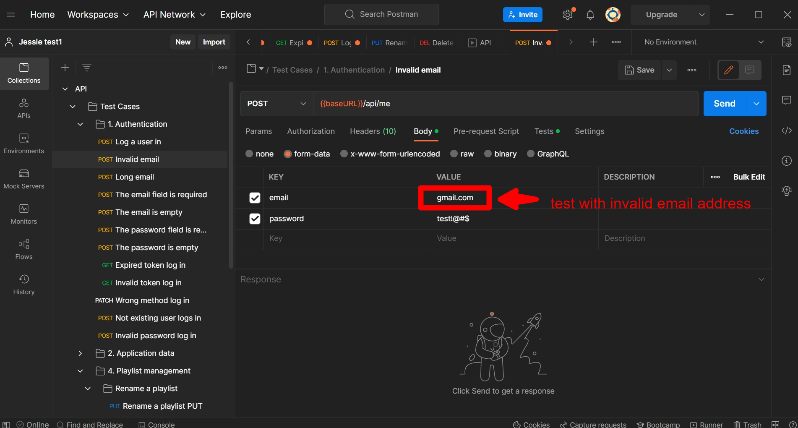
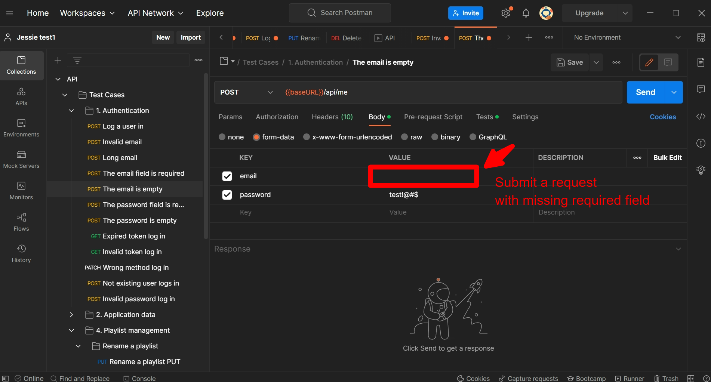
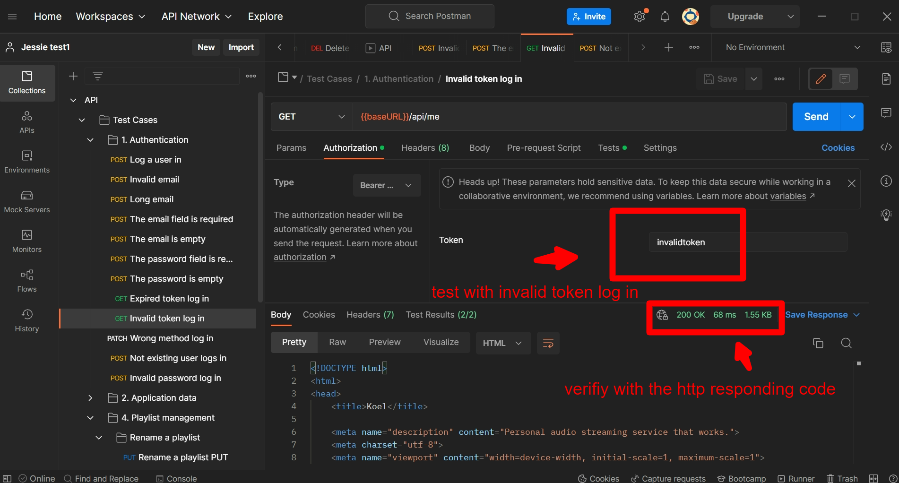
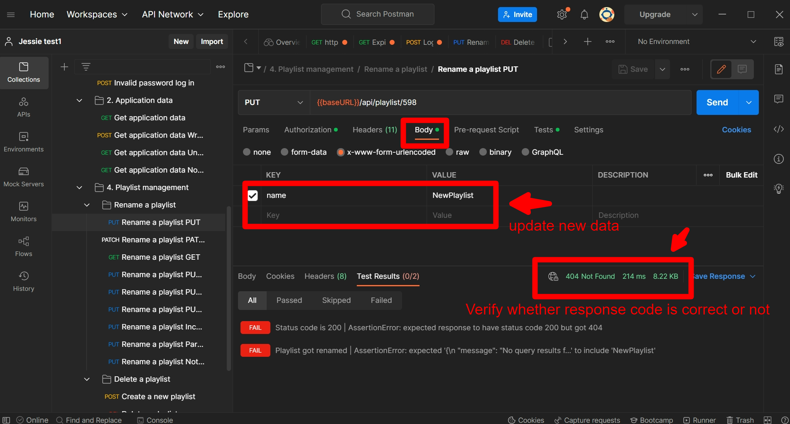

API stands for Application Programming Interface, which is a computing interface that allows communication between two applications.

Below are some concepts required to test API, things that we need to test in API, and also Postman; a software used to test API.

We will be using a web browser or mobile device for testing, and use a client applications like Postman which represents a client and send all requests to the customer’s server directly.

## Testing Critiria
**1**: Input Validation
- Submit a random text in a date field and inspect the response.
- Is there any unexpected error?
- Can the web service handle the failed attempt?
- Submit a request with missing required fields.

Example-1 invalid email address:

Example-2 missing required fields:

**2**: Authentication
Test the request improperly authenticated.

Example-1 test an invalid token when log in:

Example-2 test an invalid email address:

**2**: Validation Response
Check the response with the schema or the database.

Example-1 check an updated reponse then verify the expected response:

**3**: Verify The Limitations
Some actions are only allowed to be performed once. Make sure that limits cannot be circumvented, and that nothing breaks.

- User could only select one shipping address as active at a time in an online shop.
- User can only submit a final order completion once.

**4**: Performance
- API response time.
- Load testing.

**5**: Specification
Verify with the API’s documentation.

- All requests work as specified.
- Response should match with schema specified on the documentation.
