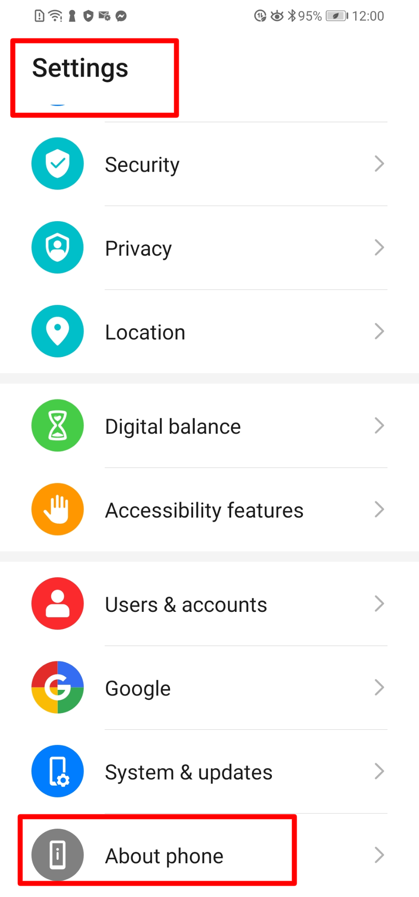
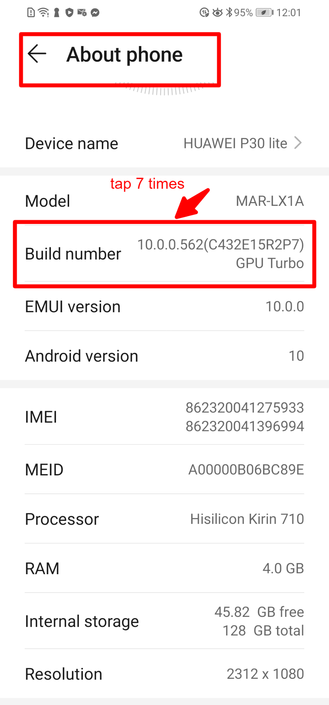
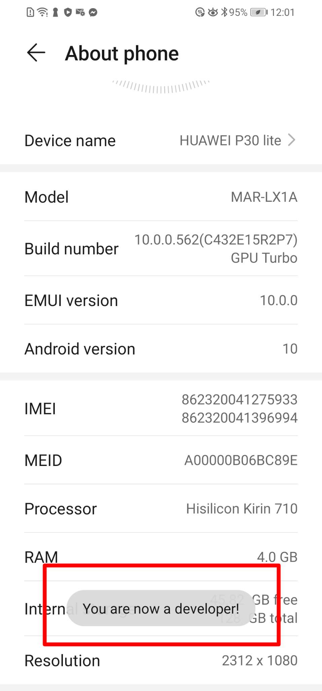
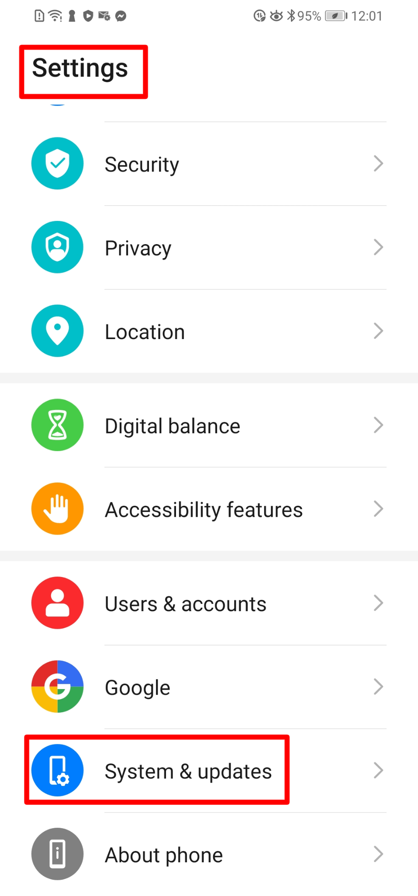
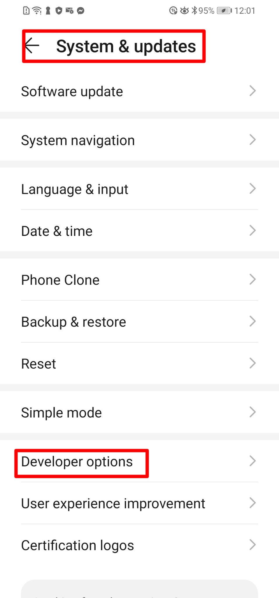
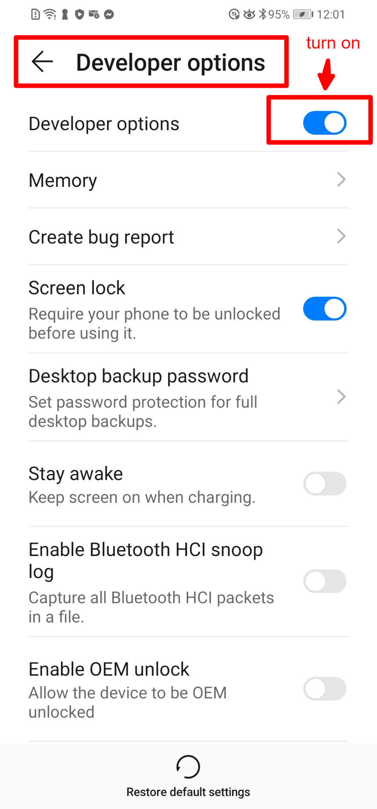

## Web app debugging part-1: Android device prerequisite

These steps are to enable USB Debugging on your device, which will allow to debugging mobile web applications using the chrome dev tool.

This example will demonstrate by using Huawei p30lite android phone.

**Step-1**: Go to settings then scroll down to "About Phone"

**Step-2**: On the about phone section, tap 7 times on "Build Number"

**Step-3**: The Developer option is now enabled, you will see the text "you are now a developer"

**Step-4**: Go to the settings and then scroll down and tap on "System and updates"

**Step-5**: Scroll down to the developer options

**Step-6**: Turn the developer option toggle to "on"

**Step-7**: Scroll down to the debugging section and turn on the toggle

