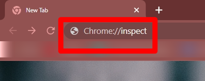
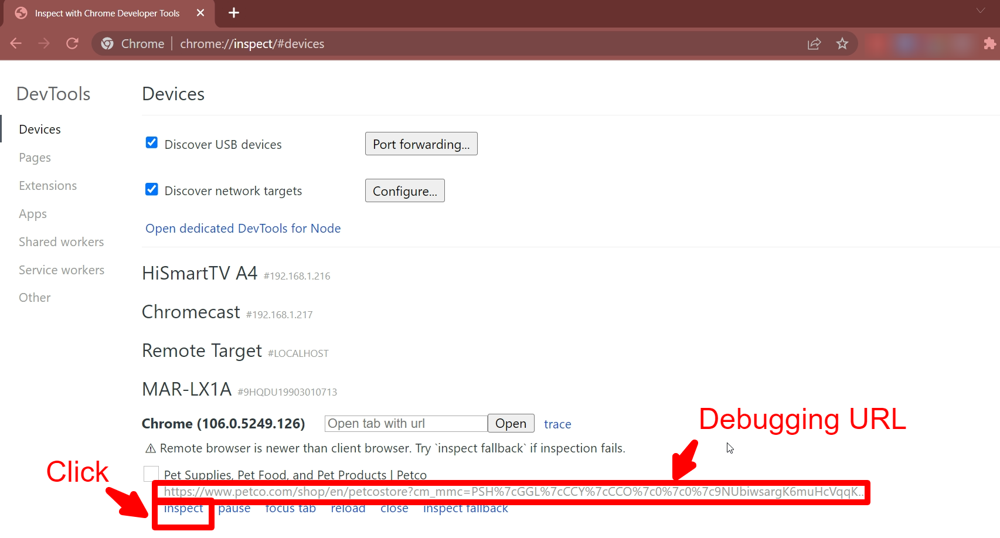
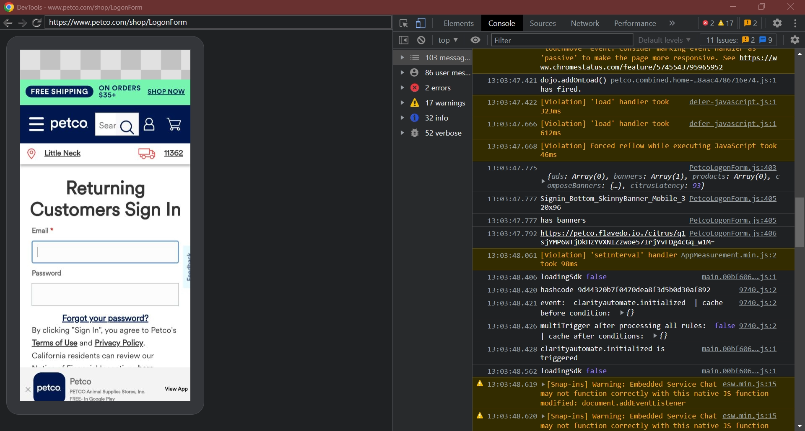
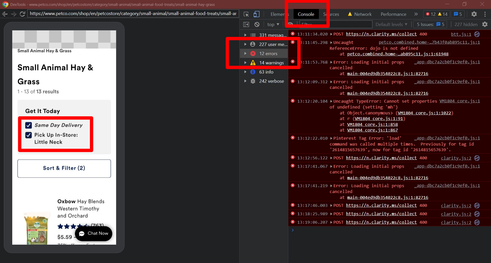

## Chrome dev tool
After we enabled debugging option on the device from [part-1](https://jessie-pastan.github.io/blogs/web-app-debugging-part-1). Turn off Adblog and VPN on the device and make sure that the Wifi connection is the same as the windows computer.

**Step-1**: Connect the device to the computer using a USB cable.

> You may see an alert on the mobile device to allow the connection, always make sure to check the box Always allow from this computer and tap on Allow

**Step-2**: Go to ‘Chrome browser and enter ‘URL’ of debugging Web app.

**Step-3**: On Windows computer open Chrome browser and  type URL  Chrome://inspect and Enter.

**Step-4**: Then will get redirected to this page, click `inspect` on the debugging URL.

**Step-5**: The device screen and the inspect panel will show up on the right side.

**Step-6**: After the inspection, there are some errors that indicate a high latency.

**Step-7**: To save log, right-click on any console area and choose `save as`. Save as type should be `Text document`, `.txt` file, then click save..

**Step-8**: An example of the console log in `.txt`.

