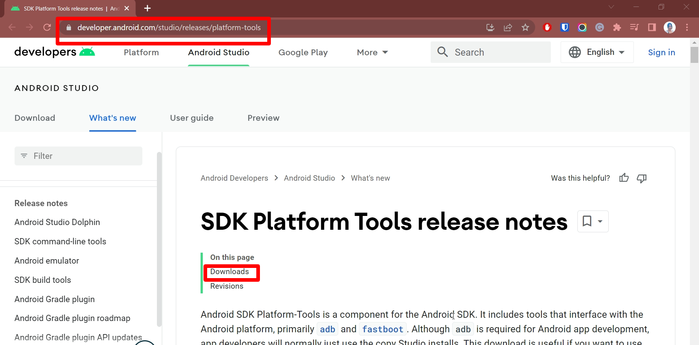
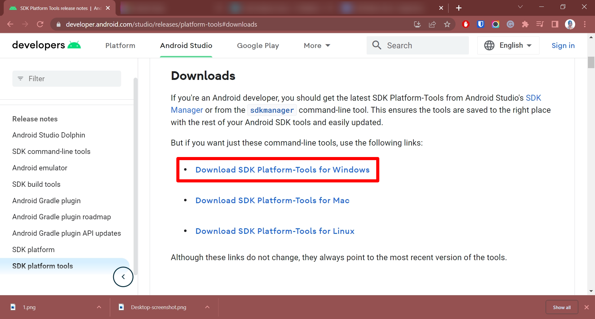
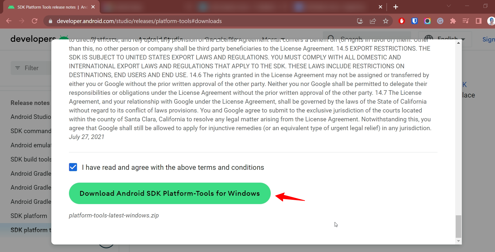
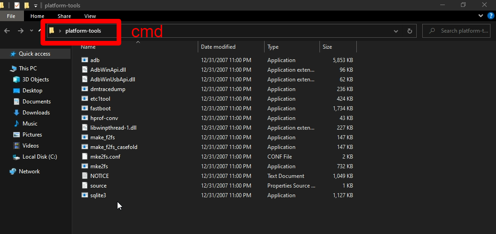
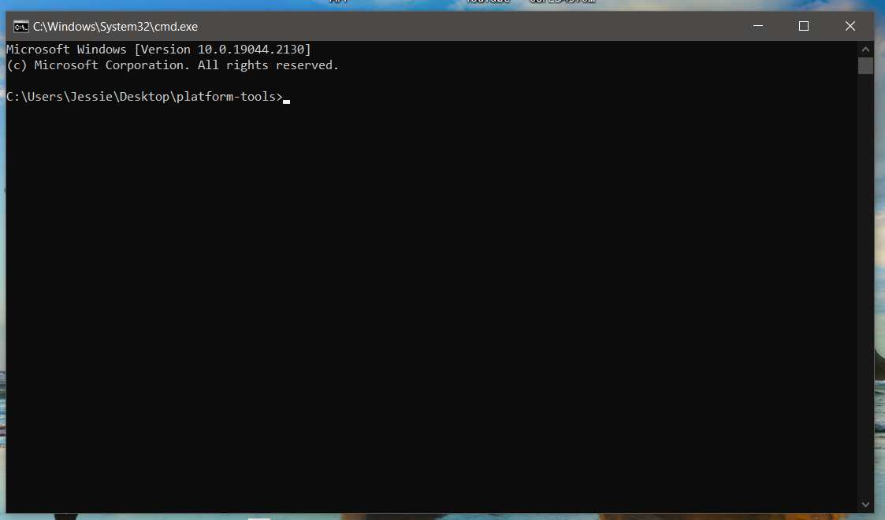
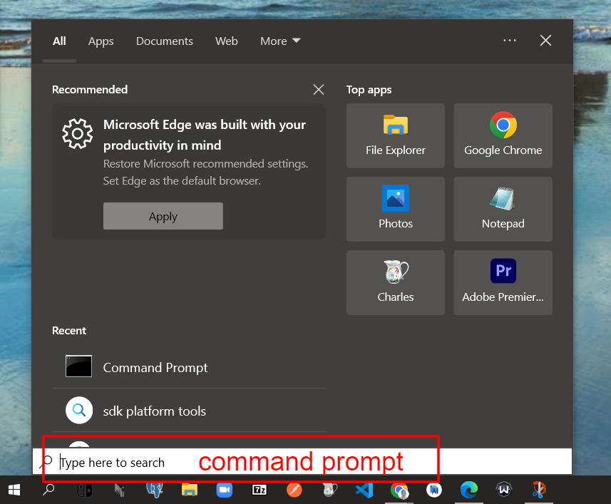
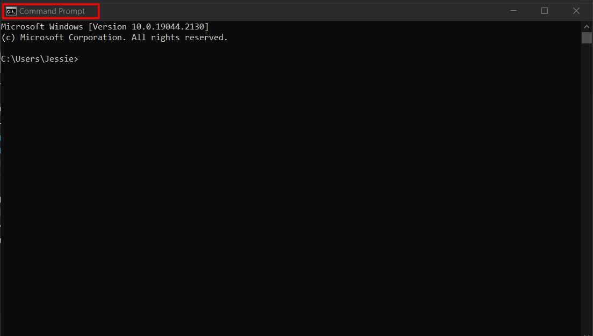
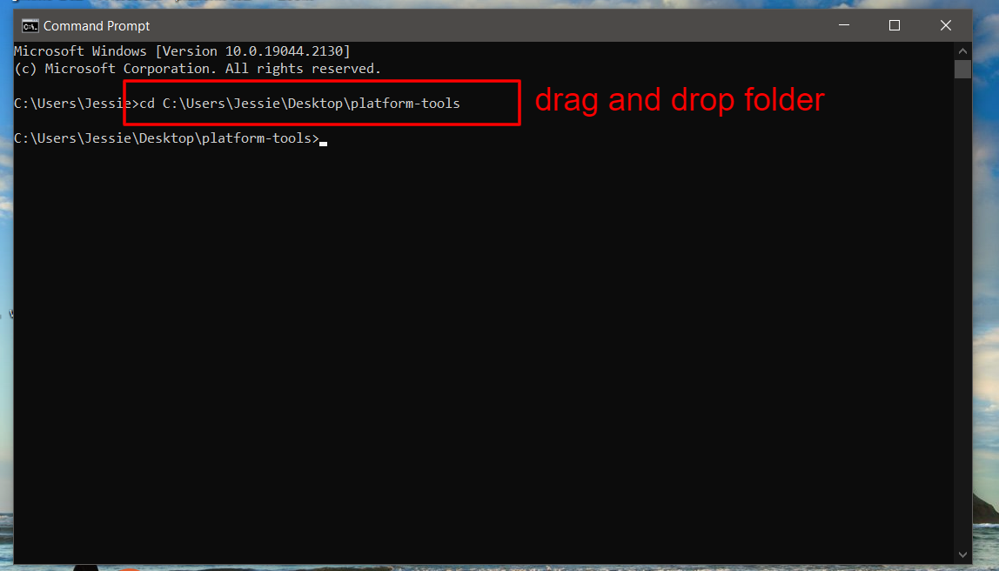

Android Debug Bridge (adb) is a versatile command-line tool that lets you communicate with a device. The adb command facilitates a variety of device actions, such as installing and debugging apps, and it provides access to a Unix shell that you can use to run a variety of commands on a device. It is a client-server program that includes three components:

- A client, which sends commands. The client runs on your development machine. You can invoke a client from a command-line terminal by issuing an adb command.
- A daemon (adbd), which runs commands on a device. The daemon runs as a background process on each device.
- A server, which manages communication between the client and the daemon. The server runs as a background process on your development machine.
adb is included in the Android SDK Platform-Tools package.

SDK Platform Tools is an official component for the development environment that is installed on a Windows OS-running laptop or PC. You can develop applications, test your code and install firmware on Android mobile devices. Essentially, the 'platform tools” is a command-line tool. They are a part of the Android SDK Manager and Android. It includes tools that interface with the Android platform, primarily ADB and fastboot.

**Step-1**: Download the SDK Platform Tools for Windows. This download is useful if you want to use adb directly from the command-line and don't have Studio installed.

**Step-2**: Unzip the file and save it on your computer's hard drive.

**Step-3**: Open the `platform-tools` folder and click on the file path by mouse, type in `cmd`, and hit enter.

> Alternatively, you can also open Command Prompt and type cd and a whitespace and drag and drop the platform-tools folder and press enter

> then Type cd space and drop platform folder

