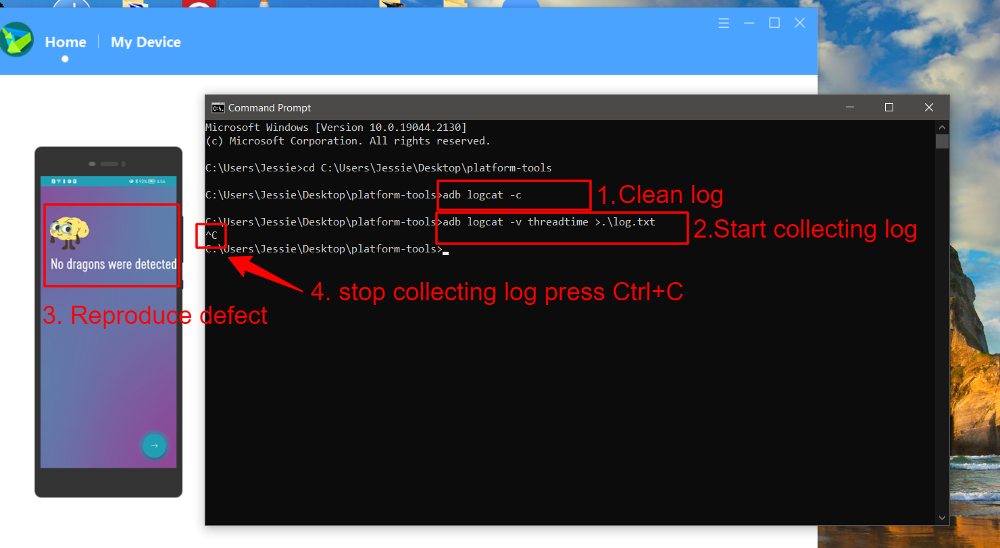
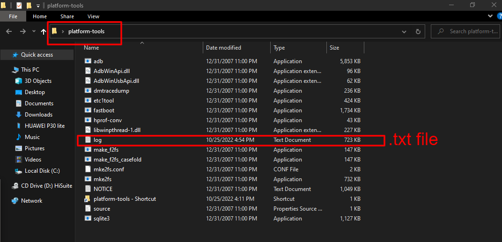

## Collect log files from android device

After enable USB Debugging on your android device, connect the device using USB cable, and have your `ADB` tools ready from [part-1](https://jessie-pastan.github.io/blogs/adb-part-1).

On the command window

**Step-1**: Clear your stored device log by running the command: `adb logcat -c`

**Step-2**: Type the command to collect the log `adb logcat -v threadtime >.\log.txt`

**Step-3**: Reproduce your bug from beginning to end.

**Step-4**: On the command line, press `Ctrl + C` to stop the process.

**Step-5**: You will see the log.txt file in the folder.

**Step-6**: Upload the log.txt file to your bug report.
