**Step-1**: On an iOS device go to settings > Safari.

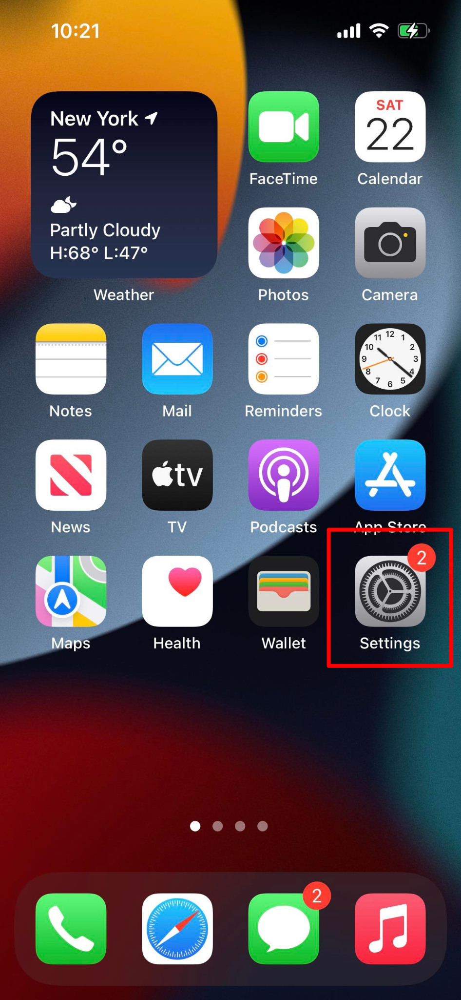

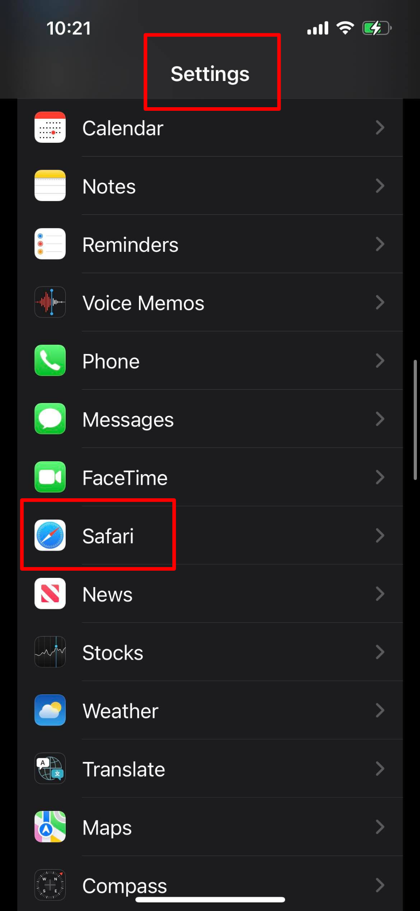

**Step-2**: Scroll down to the bottom to `Advanced`

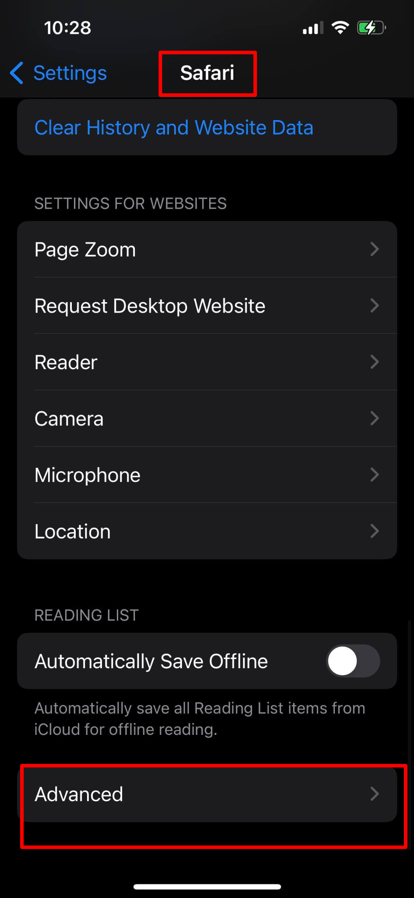

**Step-3**: Toggle on `Web Inspector`

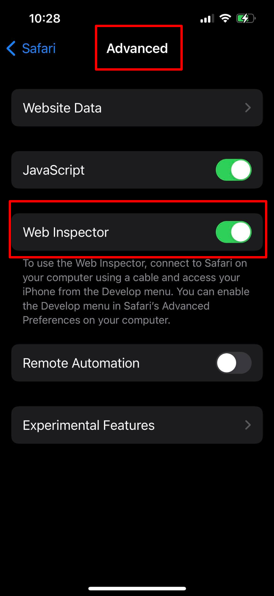

**Step-4**: Connect the device to Macbook using a USB.

**Step-5**: On Mac, open safari > Preferences

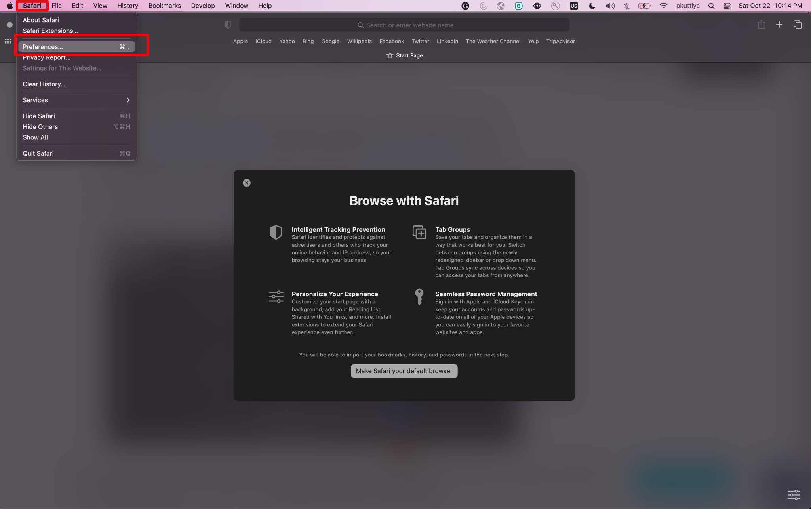

**Step-6**: Advanced and enable `Show Develop menu` in menu bar.

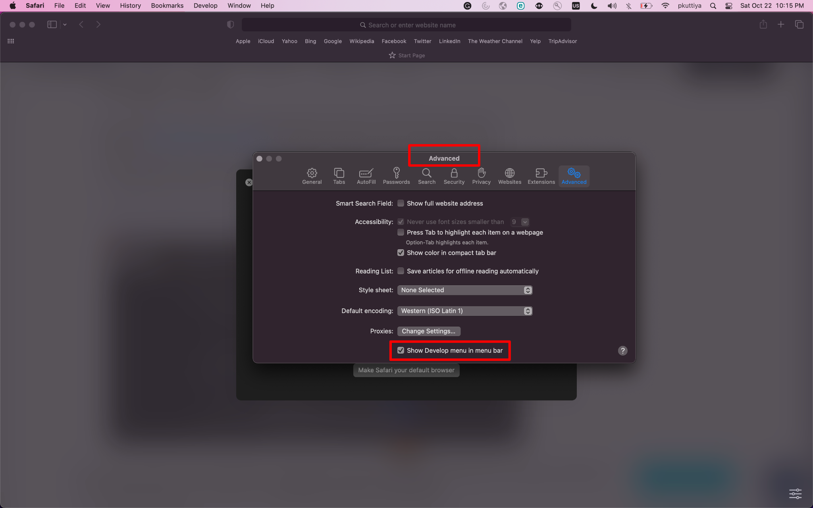

**Step-7**: From Safari browser, go to Develop > your device’s name > debugging URL

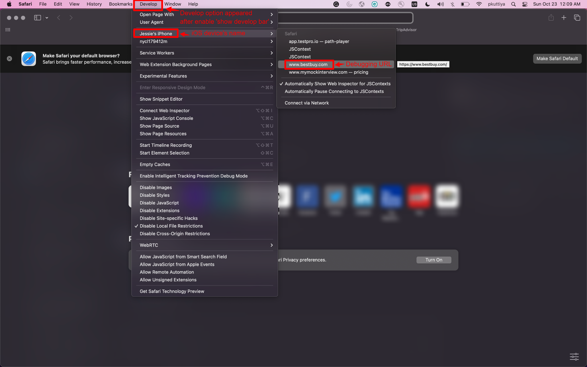

**Step-8**: Will show all logs and errors when inspecting

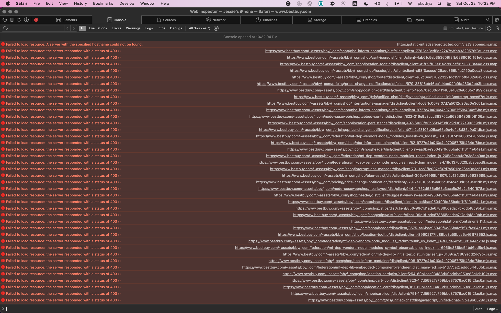

**Step-9**: To save the log from Safari dev tool press `Command + s` and save the document as a `.txt` file

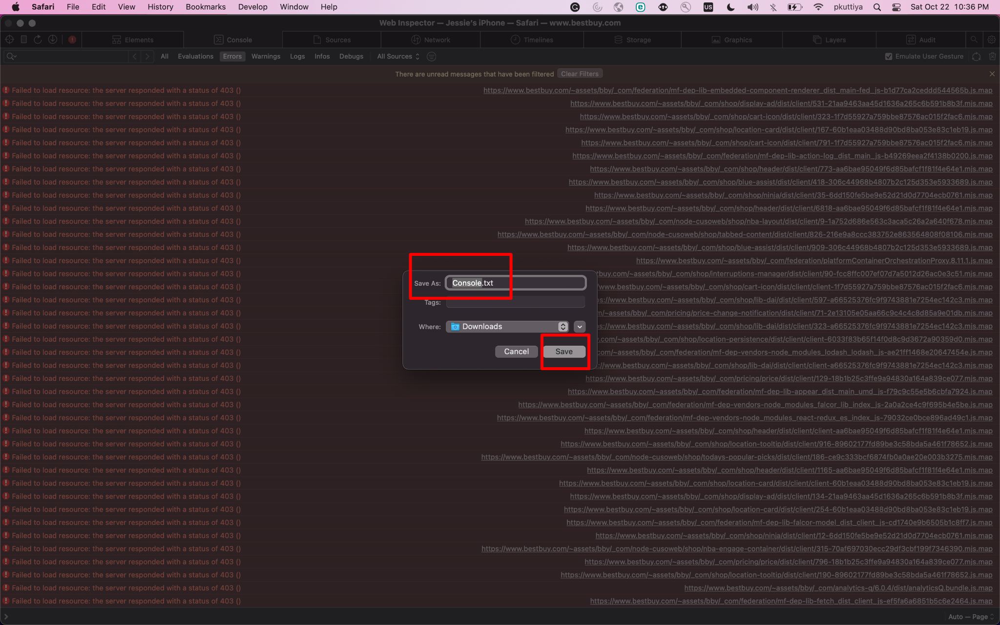

> Example of the .txt file

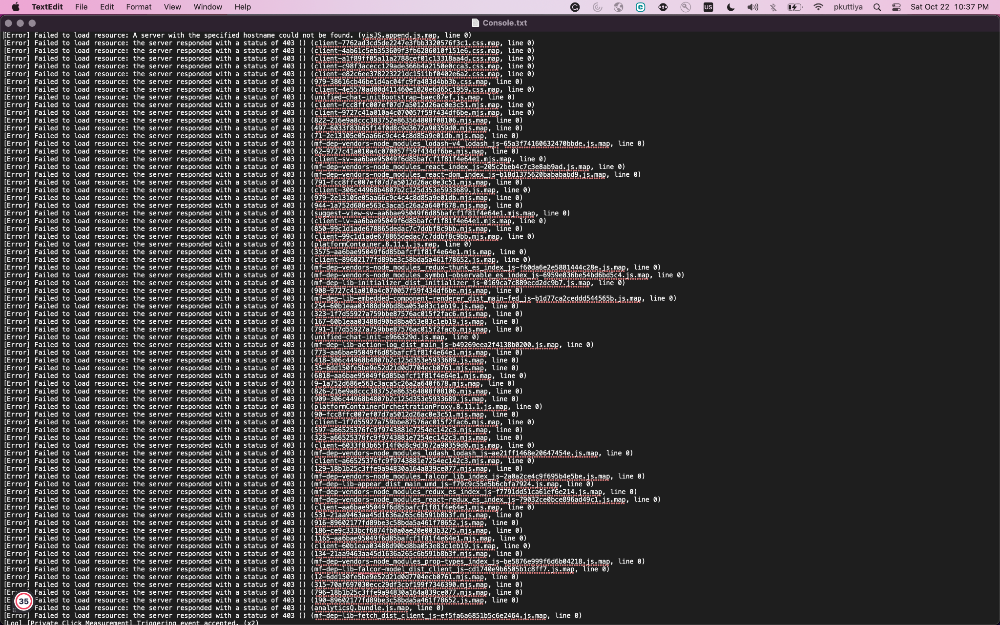

**Step-10**: Save the network by right-clicking and select `Export HAR`

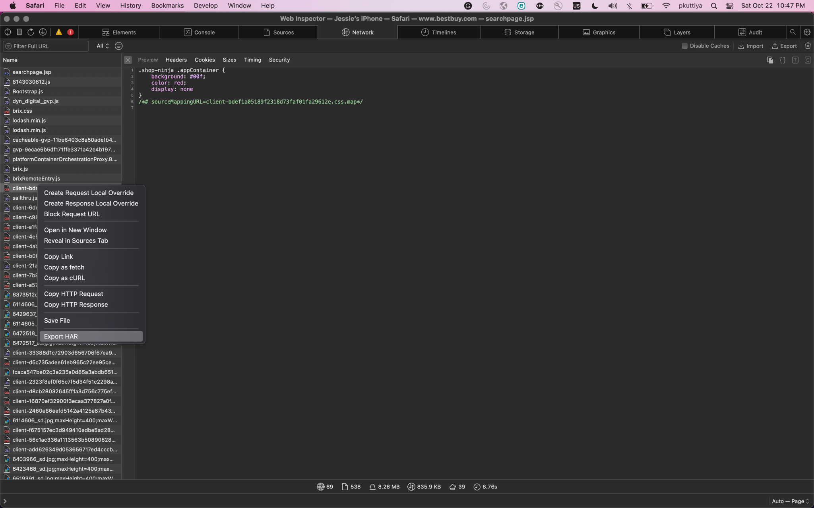

