Mobile App Testing with Charles proxy (For both android and iOS)

Below is a guide on how to use Charles proxy to monitor HTTP/HTTPS traffic between a user device and testing mobile application.

The proxy can verify whether the issue is coming from the front-end or the back-end functionality, with this tool, the tester is able to save the log file and support in debugging process effectively.

Prerequisites:
- Both computer and mobile should be connected to the same WiFi network.
- No VPNs or firewalls should be active on both device.
- Charles Proxy is running on your computer.
- Installed Charles root certificate on Andriod or iOS device.

**Step-1**: Click on Settings.

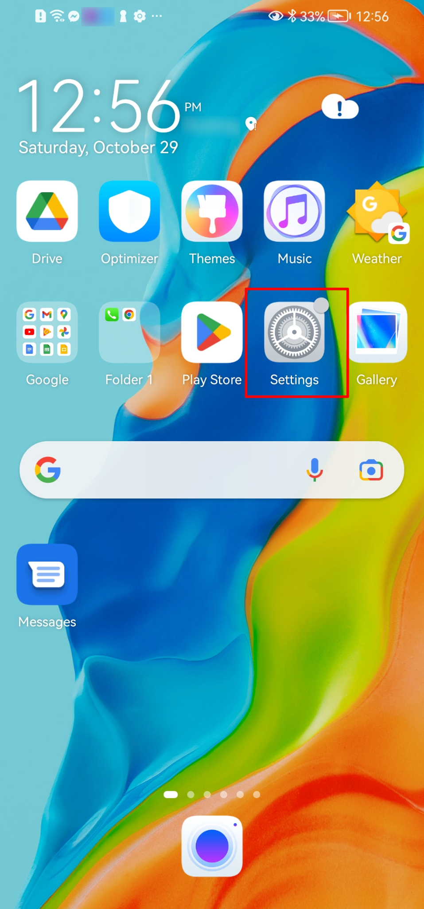

**Step-2**: Click on Wi-Fi (need to be the same connection as the computer's wifi).

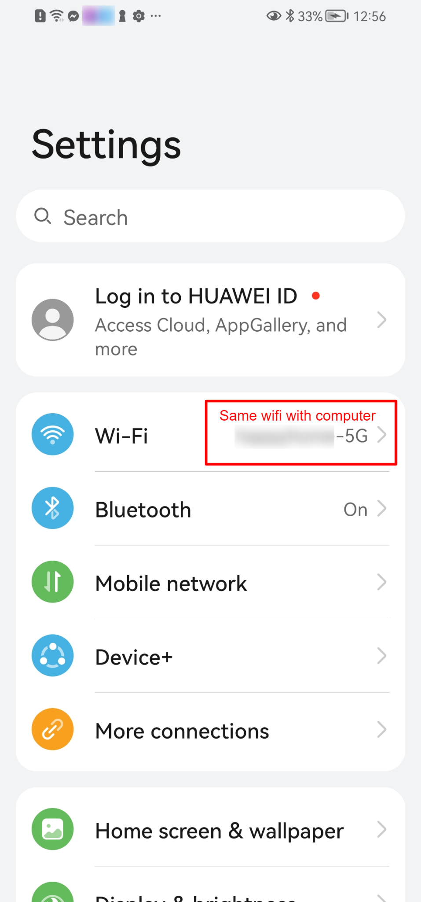

**Step-3**: Hold a second on wifi connected bar until the dropdown is shown below, then click `Modify network`.

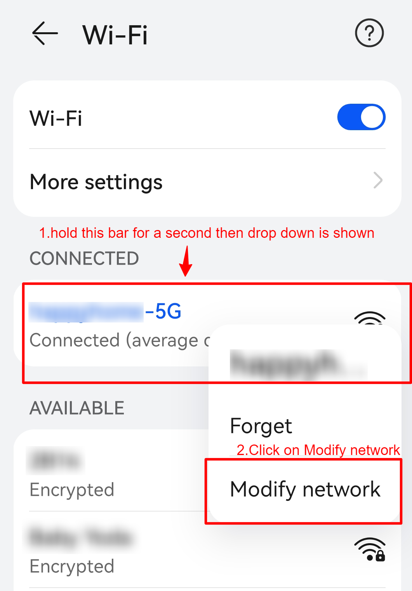

**Step-4**: Select proxy from `None’ to `Manual` then click `Save`.

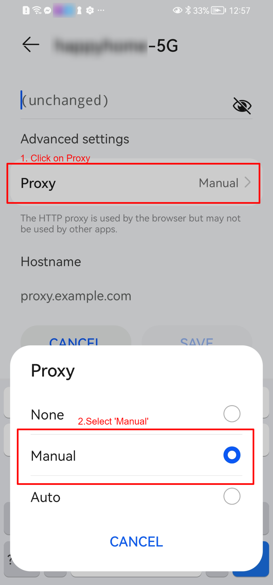

**Step-5**: Type the computer Ip Address and Port with `8888`.
> We can look up Ip Address by checking from wifi > properties

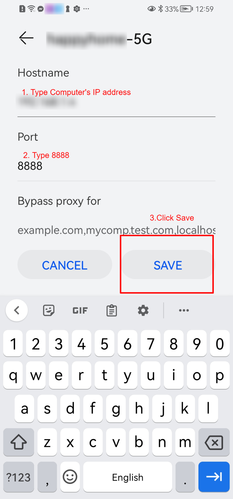

**Step-6**: Disable the Windows proxy (or MacOs proxy) by clicking on Proxy > Windows or macOS proxy. This will collect only the mobile device’s traffic and will not collect the windows’s traffic. Enable this option later when needed to collect the log from the browser traffic.

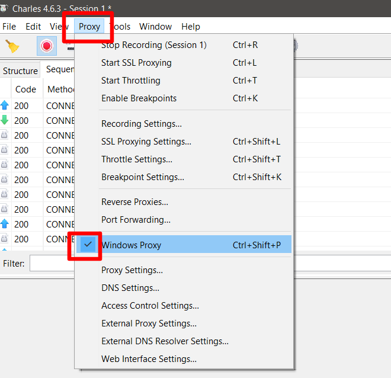

**Step-7**: The traffic between the device and the server will be encrypted for security purposes.

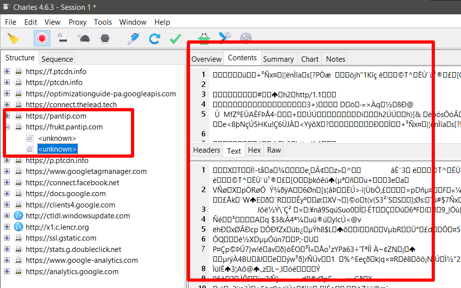

**Step-8**: Turn on the SSL setting in order to decrypt HTTPS; Proxy > SSL proxying settings.

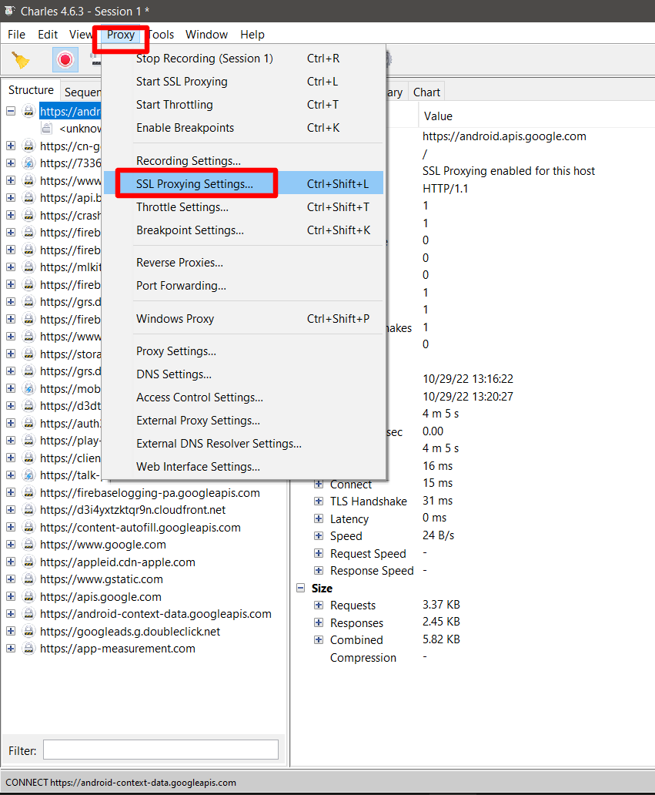

**Step-9**: Select enable SSL and location *.443 Then click `Ok`.

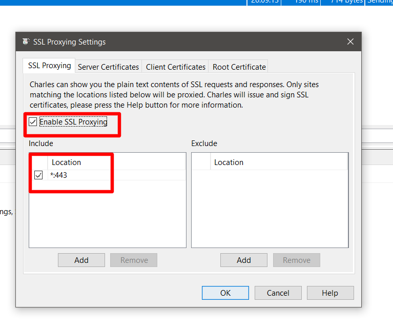

**Step-10**: After enabling SSL proxying function, all traffic will be decrypted as below.

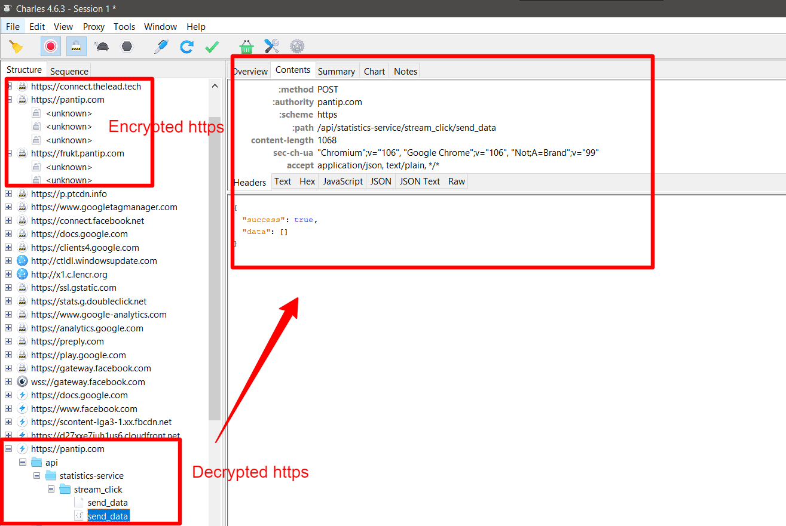

**Step-11**: Click the `Broom` icon to clear previous traffic and check if the record button is on (red) before reproducing the issue.

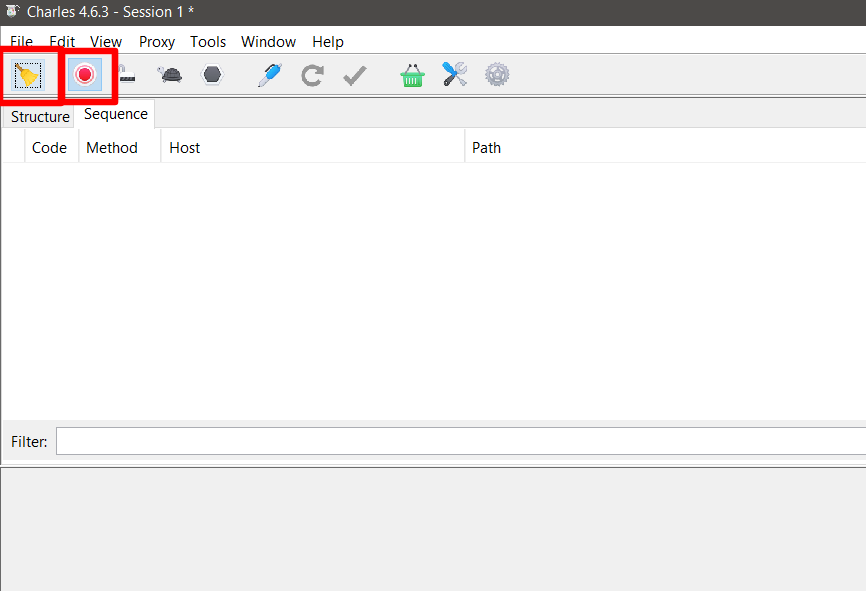

**Step-12**: Go to the testing app and reproduce the issue on the device. Then compare it with HTTPS traffic in Charles's proxy.

> Example: There is an issue when the user tries to log in to the app. The user is unable to log in and an error message occurred.

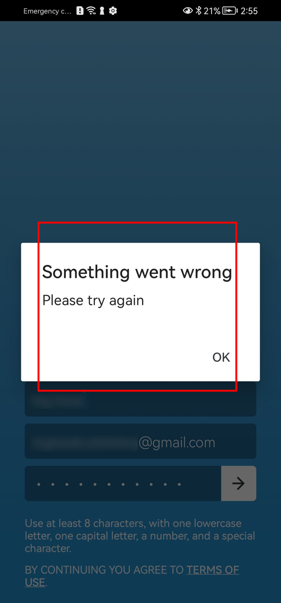

> When compared with HTTPS proxy traffic there is no failed HTTPS response and all status is 200ok, It’s possibly an issue in the front-end area.

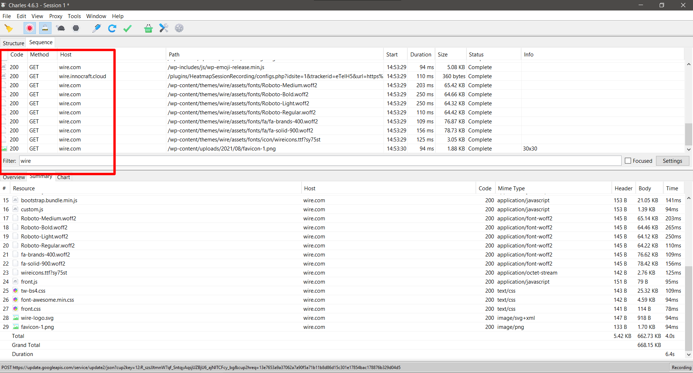

**Step-13**: To save the log, click File > export session.

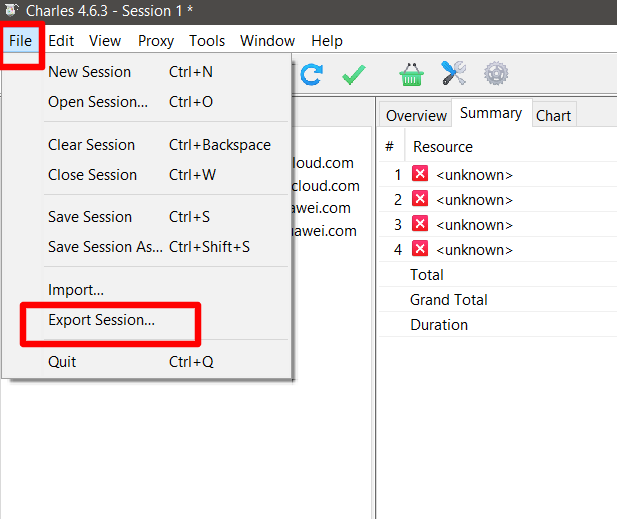

**Step-14**: Named the file and then select the file type to be `.chrl` and click `Save`

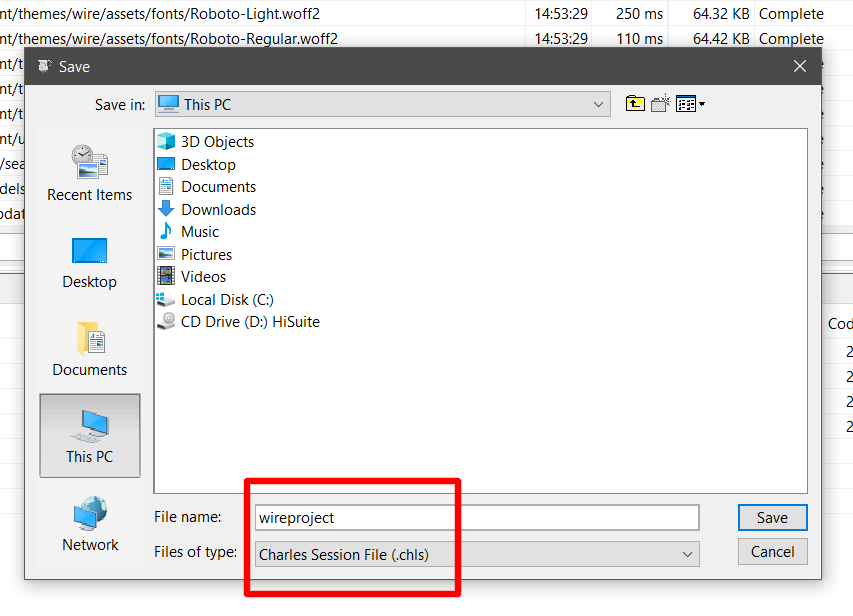

